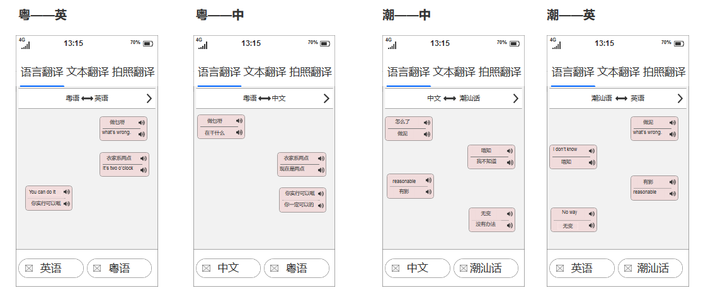
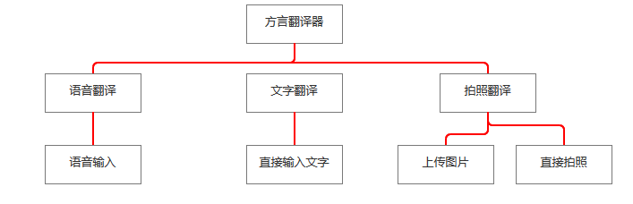

# 产品要求
|       |         |
| ------------- |:-------------:|
| Target release  |11-25-2018|
| Epic      |  方言翻译器     |
| Document status | Not started      |
|Document owner|杨欣敏|
| Designer      | 杨欣敏 |
| Developer      |  杨欣敏    |
| QA |   杨欣敏   |

## 目标
实现识别+语音合成对应，从而实现轻松方言转其他各种语言
## 背景和战略适合性
* 1.有很多年纪大的老人家，可能并不能说很完整的中文与其他人进行交流，这时翻译器可以帮助他们解决这个问题
* 2.方言翻译也是宣传中华文化的一个有力手段

## API & AI &其他
百度ai语音识别，语音唤醒
讯飞ai语音听写，文字识别
自然语言处理

## 假设
情况 | 详情
---|---
拍照翻译 | 通过“图片字识别”功能识别照片上的文字，再转为文字翻译，合成语言
语言翻译 | 通过“语音识别”识别再语言合成出翻译。

## 需求
|    #     |    Title     |       User story     |      Importance     |      Notes     |
| ------------- |:-------------:|:-------------:|:-------------:|:-------------:|
|1       | 语言不通 | 用户在进行国内外游玩时都可以用到  | 重要 | 语言识别、语言合成|
|2         |发音不标准|当用户的中文发音不标准时，使用方言也是能够达到有效翻译效果的|重要| 语言识别、语言合成|

## 用户交互和设计
智能手机APP与控制系统交互功能

## 产品原型（部分）

###产品流程图

## 问题
|    问题     |       结果    |
| ------------- |:-------------:|
|怎样方言语言输入|选择检测语言为需要的方言，然后点击带话筒的长按直接语言输入|
|有强口音问题的|可选择人工翻译|

## 不做
* 不做口音识别（同种方言可能因地区的不同，口音上会有些许差异）

