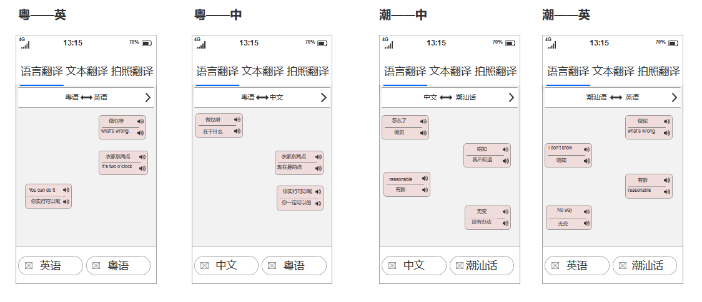

## 方言翻译APP
### 一、 产品需求文档 
|       |         |
| ------------- |:-------------:|
| Target release  |11-25-2018|
| Epic      |  方言翻译APP     |
| Document status | Not started      |
|Document owner|杨欣敏|
| Designer      | 杨欣敏 |
| Developer      |  杨欣敏    |
| QA |   杨欣敏   |

> 更多详情请点击[产品需求文档](/PRD.md) 
- 加值宣言：通过调用讯飞语音听写api和百度通用翻译api，来实现识别方言让方言得以被识别出来进行来进行与其他语言的互译。
- 核心价值：让用户能用方言来与其他语言进行互译功能。
- 用户痛点：
  - 由于地区语言环境，会（存在一些难以矫正）发音不标准的一些情况，这时候翻译器不能很好地识别出语音，这时方言翻译可以解决这个问题。
  - 用户去全国各地旅行的时候，可能会存在语言不通的情况，当地人并不会讲中文，而你也听不懂他们的语言，方言翻译器的出现可以解决这个问题。
  - 对于想要学习方言的用户来讲，也是一个很好的起步基础。

- 需求列表

|    #     |    Title     |       User story     |      Importance     |      Notes     |
| ------------- |:-------------:|:-------------:|:-------------:|:-------------:|
|1       | 语言不通 | 用户在进行国内外游玩时都可以用到  | 重要 | 百度语言识别、语言合成、翻译api、讯飞语音听写|
|2         |发音不标准 |当用户的中文发音不标准时，使用方言也是能够达到有效翻译效果的|重要| 百度语言识别、语言合成、翻译api、讯飞语音听写|
|3        |学习方言 |中外用户学习方言的一个起步器，语音字典|一般|百度语言识别、语言合成、翻译api、讯飞语音听写|
- 可行性
讯飞翻译器已经推出了方言翻译功能，不过目前只支持粤语，四川话等少部分方言。[参考文章](https://baijiahao.baidu.com/s?id=1598350854668639410&wfr=spider&for=pc) 

### 二、 产品原型部分请参见 :[PRD-原型.md](/PRD-原型.md)

- [方言翻译结构图](img/方言翻译结构图app.png)

- [产品流程图](img/方言翻译流程图app.png)

### 三、api部分请参见：[PRD-API.md](PRD-API.md)
参考文章
- [科大讯飞开放平台——语音听写接口的使用](https://www.cnblogs.com/jiayongji/p/5300563.html)
- [百度/阿里/腾讯(BAT)三家公司自然语言处理API对比与使用/价格分析以及选取](https://ptorch.com/news/178.html)

#| 价格|接入难度
---|---|---
百度 | 不开源但是免费使用|介入难度不高，直接下载SDK导入即可使用
阿里 | 每天5万次免费次数，超出后10万次(￥450),50万次 (￥2,000),100万次 (￥3,500)|接口基于阿里的套餐，接入相对百度复杂一小点点，几乎可以不计，也是API形式调用
腾讯 | 腾讯文智自然语言处理成品1～10万次价格为￥50每万次，10～50万次为￥45每万次，50～100为40每万次，100+为35每万次|接口基于腾讯云API，接入相对百度差不多，也是API形式调用。
- 就目前来说百度自然语言处理,与腾讯文智自然语言处理功能稍稍多一点点,从价格上选择百度自然语言处理。

### api纠错反馈
在app添加一个小插件或者是设计一款小程序类似与‘头脑王者’，通过答题互动，收集用户方言数据。提高方言翻译app的准确率。

### 不做
- 不做口音识别（同种方言可能因地区的不同，口音上会有些许差异）
- 不做多语言混杂同时翻译

### 清单
- [PRD.md](/PRD.md)
- [PRD-原型.md](/PRD-原型.md)
- [PRD-API.md](/PRD-API.md)

