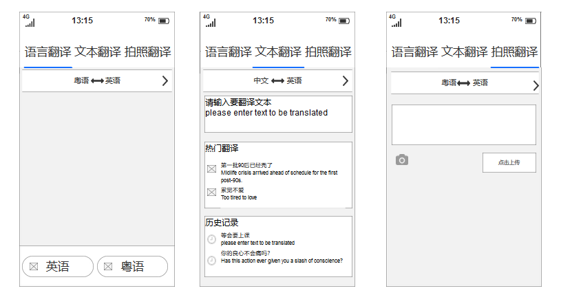

## 方言翻译
产品是一个可以实现方言转其他语言翻译

### 产品界面（部分）

## 特色
可以通过语言方言输入，来进行多种不同语种进行翻译，是一款老人也可以使用的翻译神器

## 可行性
讯飞翻译器已经推出了方言翻译功能，不过目前只支持粤语，四川话等少部分方言。
· 参考文章
https://baijiahao.baidu.com/s?id=1598350854668639410&wfr=spider&for=pc
## 需求
· 1.去各地旅行，语言不通成为第一难题。一方面方言翻译器可以自己使用方言进行翻译，另一方面可以当你听不懂他人方言的时候进行在线翻译，更好的交流。
· 2.宣传中华民族的文化宝库，使得方言能够最大程度的被人们所利用，方言不仅是本方言区人们沟通交流的工具，还是当地人表达情感的最有效、最贴切的方式，是本地有别于他地的文化血脉，是当地人得以延续的文化根。当地人在表达自己的情感时使用当地的语音和词汇，能最恰如其分、最贴切、最准确的传达出当地人的特有的情感、情绪和韵味。
## api
· 百度ai语音识别，语音唤醒
· 讯飞ai语音听写，方言转其他语种
· 自然语言处理包括使用百度ai中的机器翻译：语音翻译SDK、拍照翻译SDK
· 拍照翻译也使用百度图片技术中的文字识别
· 讯飞ai在语种多样性上远高于百度ai

